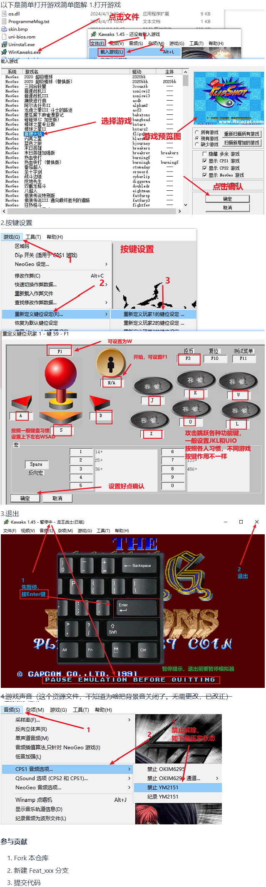

# 街机游戏下载

#### 介绍
提供方便下载

#### 软件架构
WinKawaks街机游戏模拟器

#### 安装教程

1.  注册账号，下载zip;或者克隆仓库到本地
2.  下载来自其他网站https://www.onlinedown.net/soft/1082345.htm/
3.  其他网站时间长了容易失效，本人无法保证

#### 使用说明

1.  不限速度下载，不用像百度云开会员；不需要注册账号，下载即可
2.  没有长期存在的网站，链接容易失效，所以自己上传文件，只要本人账号还在就不会失效
3.  由于100M上传限制，上传的文件不能超过100M，所以本人删除了几个里面超过100M的游戏；望谅解
4.  【街机模拟器下载 添加游戏 设置 教程】 https://www.bilibili.com/video/BV1qy4y1p7fV/?share_source=copy_web&vd_source=334233c17cbdb462a5be8cd24af9dfcd  
下载  
  

#### 参与贡献

1.  Fork 本仓库
2.  新建 Feat_xxx 分支
3.  提交代码
4.  新建 Pull Request

#### 特技

1.  使用 Readme\_XXX.md 来支持不同的语言，例如 Readme\_en.md, Readme\_zh.md
2.  Gitee 官方博客 [blog.gitee.com](https://blog.gitee.com)
3.  你可以 [https://gitee.com/explore](https://gitee.com/explore) 这个地址来了解 Gitee 上的优秀开源项目
4.  [GVP](https://gitee.com/gvp) 全称是 Gitee 最有价值开源项目，是综合评定出的优秀开源项目
5.  Gitee 官方提供的使用手册 [https://gitee.com/help](https://gitee.com/help)
6.  Gitee 封面人物是一档用来展示 Gitee 会员风采的栏目 [https://gitee.com/gitee-stars/](https://gitee.com/gitee-stars/)
